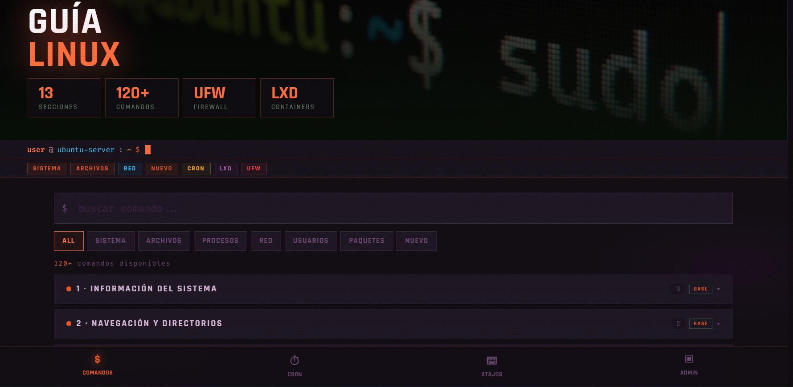

# 🐧 Linux Cheatsheet

Interactive Linux command reference — system, files, users, networking, UFW, cron and containers in a single HTML file. Dark cyberpunk UI.

---

# 🚀 Live Demo

👉 [Ver en GitHub Pages](https://narufortix.github.io/linux-cheatsheet/)

---

# 📄 Uso

Descarga `index.html` y ábrelo en cualquier navegador.

No requiere:

* instalación
* dependencias
* backend
* conexión externa

Todo funciona offline en un único archivo HTML.

---

# ⚡ Contenido

Incluye más de 120+ comandos organizados por categorías:

* 🖥️ Sistema
* 📁 Archivos y navegación
* 🔎 Búsqueda y texto
* ⚙️ Procesos y servicios
* 🌐 Networking
* 🔥 UFW Firewall
* 👤 Usuarios y permisos
* 📦 APT / Snap
* ⏰ Cron Jobs
* 📦 Containers LXD
* 🧠 Tips Linux
* ⌨️ Shortcuts terminal
* 🛠️ Administración básica

---

# 🎨 Características

* UI cyberpunk responsive
* Optimizado para móvil
* Búsqueda interactiva
* Navegación rápida
* Copia instantánea de comandos
* Categorías organizadas
* 100% offline
* Single HTML file

---

# 📸 Preview

---

# ⚠️ Disclaimer

Solo para uso educativo y administración autorizada de sistemas.

---

# 📜 Licencia

MIT License
